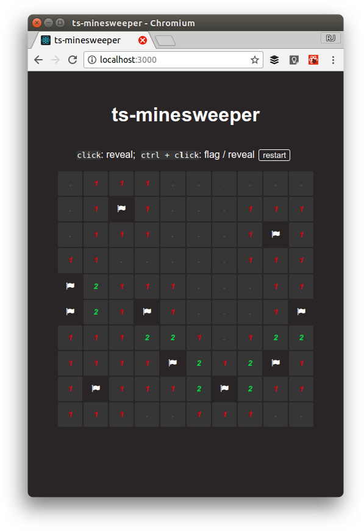

# ts-minesweeper

Minesweeper clone with TypeScript, Redux, and React

  

## Usage

Install and build demo application:

    $ yarn
    $ yarn start

...now open http://localhost:3000 to start sweeping mines!

## License

MIT
